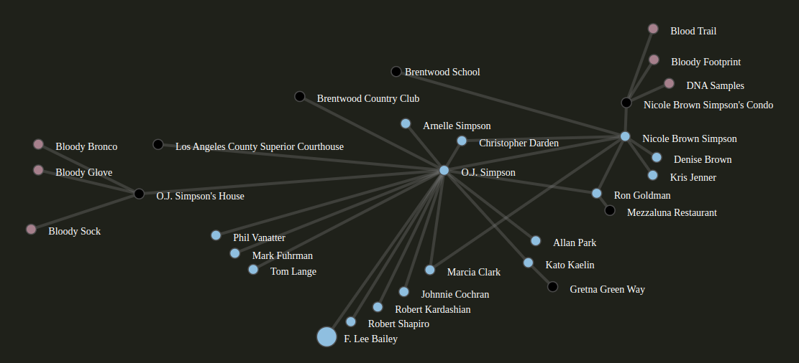

# graph-data-workspace-app
Graph data visualization app structured around type dictionaries.



JSON schema is used to define all the node and edge types ( there are meta-schemas nodeTypeSchema and edgeTypeSchema )

### How to run:
Nothing elaborate, it's an express app:
```
$> cd backend/
$> node index.js
```
The UI will be up on port 3000

### Concepts
* Dictionary - defined as the contents of a directory beneath /dictionaries/ - contains Node and Edge type definitions. See the included examples
* Node - one or more types per dictionary
* Edge - one or more types per dictionary
* Graph - actual data , referencing a dictionary ( composed of Node and Edge types )
* Board - one instance or workspace for a graph

### Examples
There are examples of Dictionaries and Graphs that use them included here as an example. Each dictionary's *nodes* and *edges* directories contain JSON schema according to `schemas/nodeTypeSchema` and `schemas/edgeTypeSchema` respectively.

The example graphs validate against `schemas/graphSchema` and are a combination of randomly generated data and plundered from other sources. 
*** Examples are a work in in progress ***

### API Support
Almost none yet beyond directly supporting the frontend, but there is a really simple update API

```
POST
curl -X POST -H "Content-Type: application/json" -d @test_update.json http://localhost:3000/graph/demo.json/update
```

### TODO & other directions
* Better examples of graphs
* OpenAPI spec
* improve the update API /graph/:filename/update
* deveolop 'boards' - instances of a graph that may include annotations, updates, and 'state' data
* develop temporal edges including support in visualization ( filter edges by time windows )

Brainstorm:
* A timeline slider to filter any temporal edges in the graph

### Notes

Part of the motivation for this was to learn about JSONSchema and in reality was an exercise in impelmenting meta-types. Doing it with JSONSchema makes for some challenging syntax.


